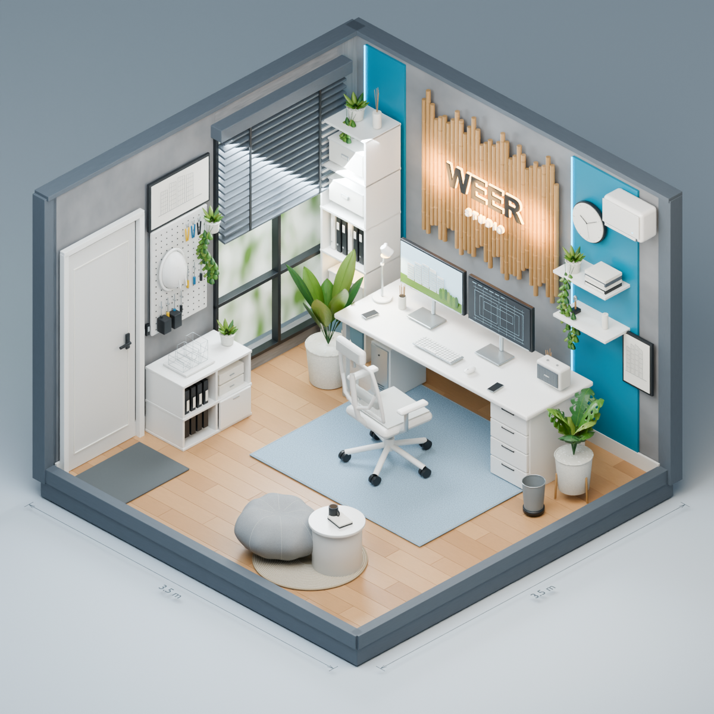
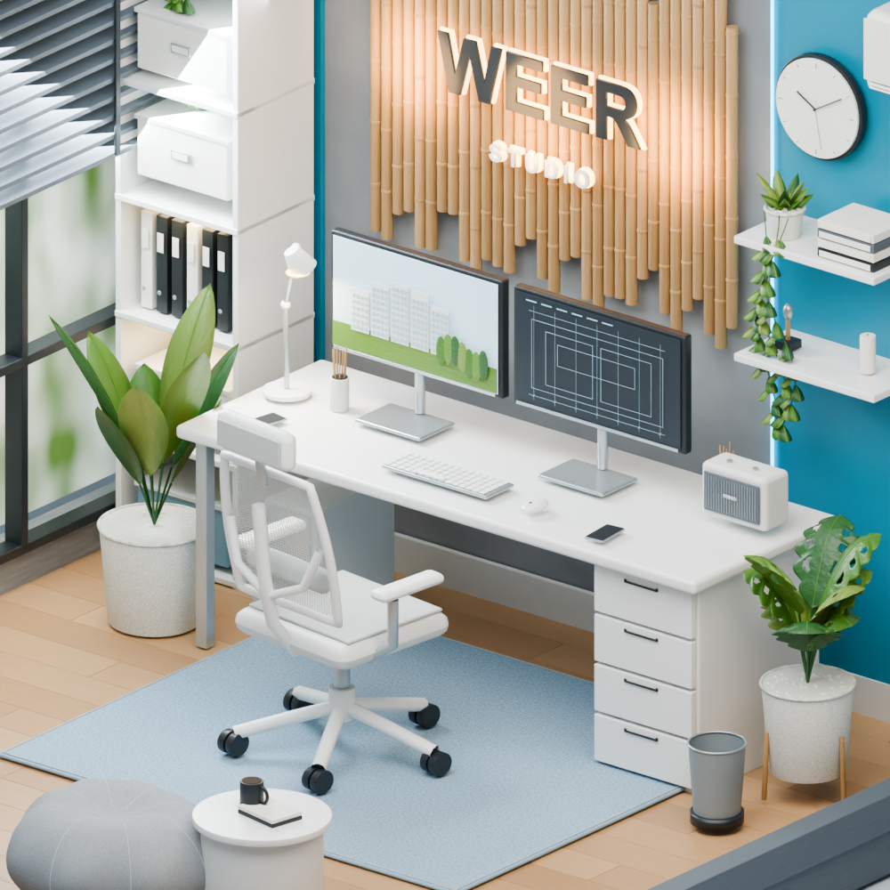
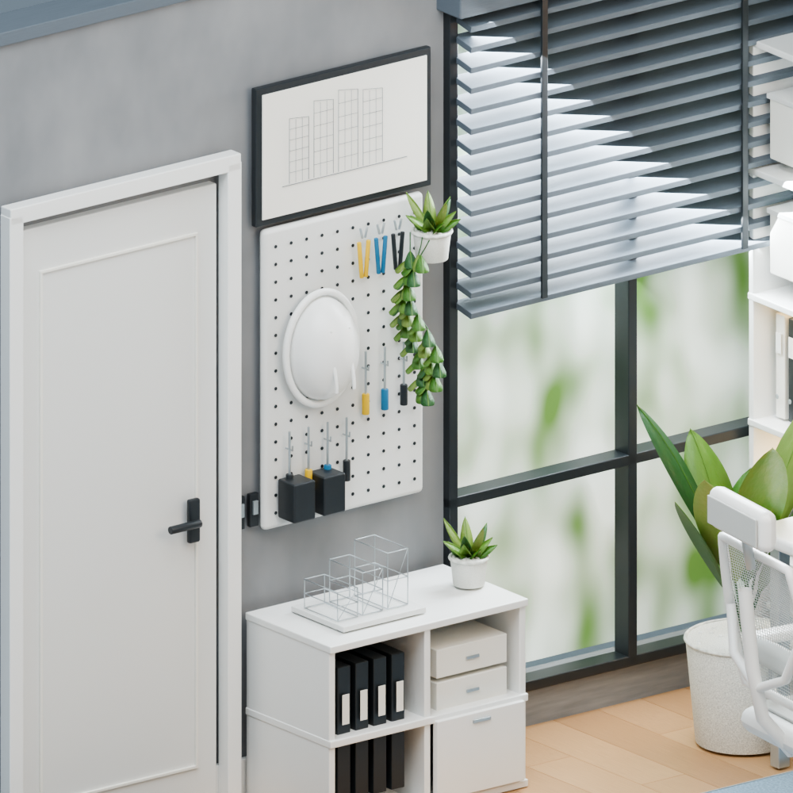

# WEER Studio — 3D Office (Blender → Interactive Web)

ห้องทำงาน 3D ที่สร้างใน Blender แล้วแปลงเป็นเว็บ interactive ด้วย Three.js + TypeScript

**Live demo:** <https://weerora.github.io/blender3d/>



## ภาพรวมโปรเจกต์

Repo นี้มี 2 ส่วนหลักที่ทำงานร่วมกัน:

1. **Blender scene** (`Office_Studio_v02.blend`) — ห้องทำงานขนาด 3.5×3.5 ม. สร้างจาก
   ภาพอ้างอิงด้วยสคริปต์ `build_office_v02.py` (แบ่งเป็น 6 phases) ใช้ procedural
   materials และ Cycles render
2. **Web app** (`src/`, `index.html`, Vite) — โหลดโมเดล GLB ที่ export มาจากไฟล์
   Blender ขึ้น renderer ของ Three.js ให้ผู้ใช้หมุน/ซูมห้องและโต้ตอบกับวัตถุต่าง ๆ
   ได้จริงในเบราว์เซอร์ ไม่ต้องมี backend

| อ้างอิง (ภาพต้นแบบ) | Blender render | Desk detail |
| --- | --- | --- |
|  |  |  |



## สิ่งที่โต้ตอบได้บนเว็บ

| วัตถุ | การทำงาน |
| --- | --- |
| เก้าอี้ | หมุนครั้งละ 90 องศา |
| จอคู่ | สลับภาพงานออกแบบ / Focus / ปิดจอ |
| โคมไฟ | เปิด–ปิดวัสดุเรืองแสงและแสงบนโต๊ะ |
| ประตู | เปิด–ปิดรอบจุดบานพับ |
| ลิ้นชัก | เปิด–ปิดแยกแต่ละชั้น |
| มู่ลี่ | ยกขึ้น–ลดลง |
| โลโก้ | เปิด–ปิดไฟอุ่นหลังตัวอักษร |
| แอร์ | เปิด–ปิดและปรับอุณหภูมิจำลอง |
| ลำโพง | เล่นเสียง ambient (Web Audio) และปรับระดับเสียง |

รายละเอียดการควบคุมกล้อง/มือถือ/คีย์บอร์ดทั้งหมดอยู่ใน [WEB_README.md](WEB_README.md)

## โครงสร้างไฟล์

```
Office_Studio_v02.blend        # Blender scene ต้นฉบับ
build_office_v02.py            # สคริปต์สร้างฉากใน Blender (6 phases)
scripts/export_web_asset.py    # export geometry จาก Blender → asset สำหรับเว็บ
scripts/optimize-asset.mjs     # dedupe/weld/prune + Meshopt compression (glTF-Transform)
public/models/office-studio.glb # โมเดลบีบอัดที่เว็บใช้จริง (~7.5 MB)
src/                            # เว็บแอป: room.ts, main.ts, catalog.ts, audio.ts
index.html, vite.config.ts      # Vite entry point และ config
.github/workflows/deploy-pages.yml # deploy อัตโนมัติขึ้น GitHub Pages ทุกครั้งที่ push main
```

## เริ่มใช้งาน (เว็บแอป)

ต้องมี Node.js (แนะนำ Node 24, ตาม lockfile)

```sh
npm ci
npm run dev       # เปิด dev server เช่น http://127.0.0.1:5173/
```

```sh
npm run build     # tsc --noEmit + vite build → dist/
npm run preview   # preview production build
```

นำโฟลเดอร์ `dist/` ไป host แบบ static ได้เลย ไม่มี backend (เปิดผ่าน `file://` ตรง ๆ ไม่ได้)

## การอัปเดตโมเดลจาก Blender

1. เปิด `Office_Studio_v02.blend` ใน Blender
2. รัน `scripts/export_web_asset.py`
3. รัน `npm run asset:optimize`
4. รัน `npm run build` แล้วตรวจเว็บอีกครั้ง

## เอกสารเพิ่มเติมในโปรเจกต์

- [WEB_README.md](WEB_README.md) — รายละเอียดเว็บแอป, tech stack, การ interaction ทั้งหมด, model pipeline
- [Office_Studio_v02_README.md](Office_Studio_v02_README.md) — รายละเอียด Blender scene, ขนาดห้อง, ไฟล์ภาพอ้างอิง
- [WEB_QA.md](WEB_QA.md) — ผล QA ที่ทดสอบผ่าน Playwright (build, interaction, mobile viewport ฯลฯ)

## Tech Stack

Blender (Cycles) → `export_web_asset.py` → glTF-Transform (`optimize-asset.mjs`, Meshopt) →
Three.js + TypeScript + Vite → GitHub Pages (auto deploy ผ่าน GitHub Actions)
